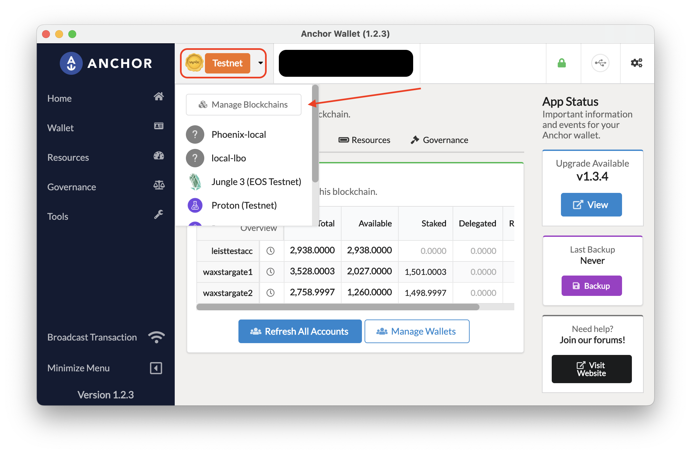
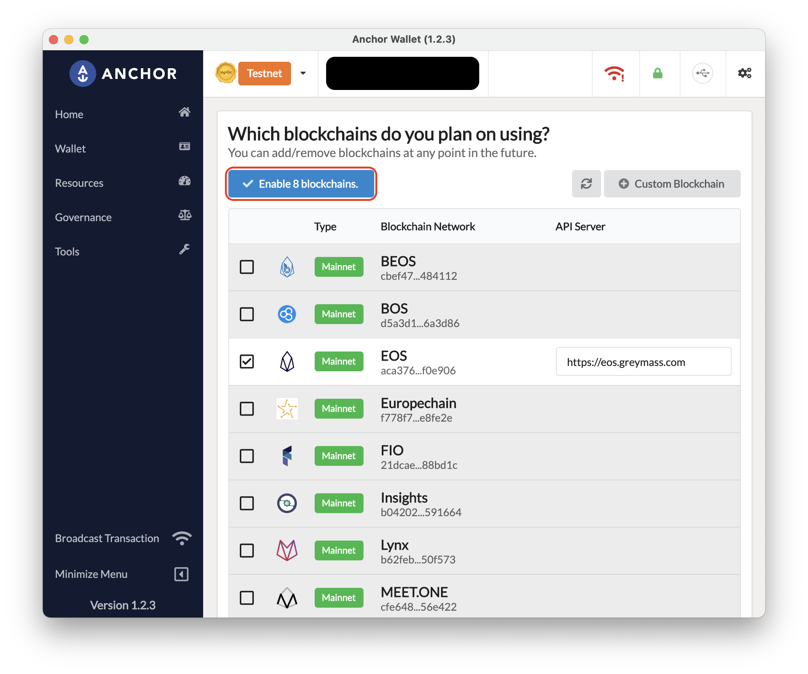

# Guides
Here are some examples of useful configurations to do before getting started testing with a local blockchain like eos-local.

## Set up eos-local with Anchor
Following is defined a list of actions that are required to successfully set up a local blockchain with the Anchor Wallet.

Before getting started with the steps, let's get running this Local EOS Blockchain.
1. Move to the project root folder.
2. Run `cp .env.example .env` to have local variables ready to be used.
3. Run `make run` to start the local blockchain.

### Steps to connect Anchor Wallet with eos-local
1. Open Anchor Wallet.
2. Click on `Manage Blockchains`.
   
3. Scroll down to `Add/Remove` and click.
   
4. Click the `Custom Blockchain` button.
   
5. Fill the needed information.
   In this point, Anchor Wallet is asking for some information that is needed to correctly set up a new blockchain. Having the blockchain running, open next link [http://localhost:8888/v1/chain/get_info](http://localhost:8888/v1/chain/get_info) to get that data.

   We should to be able to get something like this:
   ```json
    {
        "server_version": "6b45f4e3",
        "chain_id": "856de91bed1633c1e6e65eb397da4fc98a0b65afc0f658b01cfda35190f16d55",
        "head_block_num": 2630,
        "last_irreversible_block_num": 2629,
        "last_irreversible_block_id": "00000a456f5f9c4551435eeb1f1f9feefb5e22cfffabc971cbdc51c944e3a02a",
        "head_block_id": "00000a46c95c61fe167fd9518eec510c57727336e844ed43df6285b656966e16",
        "head_block_time": "2022-05-12T14:11:26.000",
        "head_block_producer": "eosio",
        "virtual_block_cpu_limit": 2769158,
        "virtual_block_net_limit": 14545913,
        "block_cpu_limit": 199900,
        "block_net_limit": 1048576,
        "server_version_string": "v2.1.0",
        "fork_db_head_block_num": 2630,
        "fork_db_head_block_id": "00000a46c95c61fe167fd9518eec510c57727336e844ed43df6285b656966e16",
        "server_full_version_string": "v2.1.0-6b45f4e3909981866c8f1347126a709097bed4a5",
        "last_irreversible_block_time": "2022-05-12T14:11:25.500",
        "total_cpu_weight": 0,
        "total_net_weight": 0
    }
   ```

   Chain ID -> chain_id  
   Name of Blockchain -> `any_name`  
   Default node for this blockchain -> `http://localhost:8888`  
   
   *Advanced Configuration*
   Default Token Symbol (EOS/TLOS/etc) -> `EOS`
6. Click the `This blockchain is a test network (TESTNET)`.
   
7. Click on Save.
8. Click on `Enable <number> blockchains.`
   
9. Select the new added local blockchain.


### Steps to register an account with Anchor Wallet.
1. Create a wallet.
   ```sh
    cleos wallet create -n <wallet_name> --file <wallet_name>.pwd
   ```
2. Import your `eosio` private key into your new wallet (do not use this command in public terminals, in public terminals remove `--private-key`, then the termial will ask you for you private key).
   ```sh
    cleos wallet import -n <wallet_name> --private-key <private_key>
   ```
3. Create a new account with cleos.
   ```sh
    cleos system newaccount eosio --transfer <new_account> <pub_key> --stake-net "10000 EOS" --stake-cpu "10000 EOS" --buy-ram "10000 EOS"
   ```
4. Your account is now registered on the blockchain.
5. Open Anchor Wallet.
6. Select the local blockchain you have created in `Steps to connect Anchor Wallet with eos-local`.
7. Click on `Manage Wallets`.
8. Click on `Import Account(s)`.
9. Click on `Import an existing Account`.
10. Select `Existing Account`.
11. Click on `Import Private Key`.
12. Paste the private key for the account you want to register.
13. Click on `Import Account(s)`.
14. Now you are registered to open a [local blockchain explorer](https://local.bloks.io/) and start signing actions.