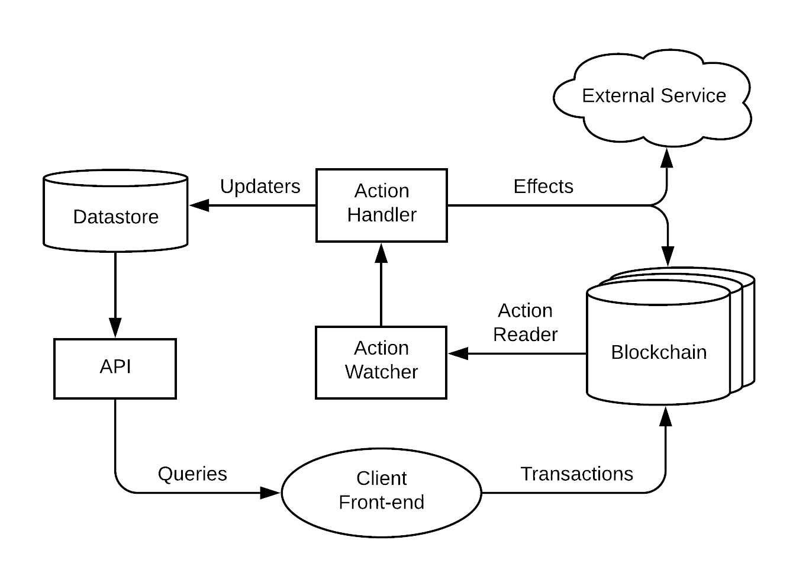
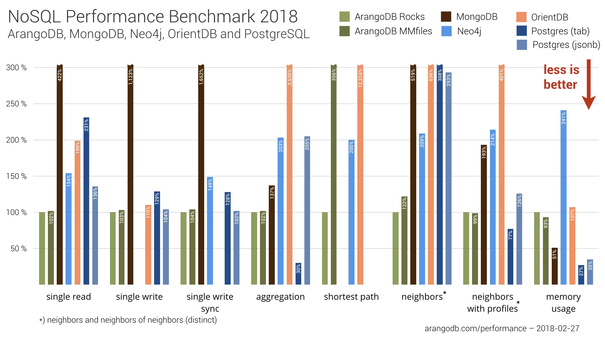
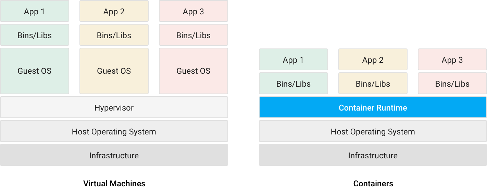

<p align="center">
	</a>
	<a href="https://git.io/col">
		
	</a>
	<a href="https://discord.gg/bBpQHym">
		
	</a>
	<a href="https://twitter.com/intent/follow?screen_name=eoscostarica">
		
	</a>
	<a href="#">
		
	</a>
</p>

<p align="center">
	<a href="https://eoscostarica.io">
		
	</a>
</p>

# EOS Local 

The quickest and most efficient way to setup and maintain a local environment for development that is guaranteed to work out-of-the-box across the different host operating systems: Mac OS, Windows, and Linux.

It is a reusable docker based development environment inspired on MonsterEOS' EOSIO DreamStack architecture that will allow you to develop EOS applications faster.

EOS Local is a community-driven project led by EOS Costa Rica. We welcome contributions of all sorts. There are many ways to help, from reporting issues, proposing features, improving documentation, contributing code, design/ux proposals.

**Important Disclaimer: This is a Work in Progress** 

## Advantages

- Get started with EOS DApp development in less than 5 minutes with a single command.
- Focus on your biz logic, not on configurations or integrating commonly used third party-services.
- Scalable microservices architecture. 
- Deploy your dApp dedicated services easily to any infrastructure provider with containers.  
- Ability to run multiple versions of EOS with different configuration with no conflicts.
- This project follows EOS DApp development best practices.

## Technical Specs

- Fully virtualized EOS blockchain development environment.
- Microservices architecture.
- Out-of-box services: 
  - Postgres database.
  - Mongodb database.
  - Demux service.
  - Eos-dev node for contract dev and compilation.
  - Eos fullnode with history.
  - Graphql endpoint.
  - Reactjs client with:
    - Scatter integration.
    - Lynx integration.
    - EOS Account profile page.
    - Material UI.
    - GraphQL Apollo client.
- Services accessible through virtual host names both from host machine and within the docker network.
- Handy scripts for interacting with the local EOS services.
- Gulp as global task manager.
- Automated code linting and testing.
- Automated "seeding" of testing accounts and contract compilation.
- Continuous Integration and Deployment. ( Travis and Netlify )
- Kubernetes support ( coming soon https://github.com/eoscostarica/eos-local/issues/8 )

*Note: at the moment we are not using a docker container for running the React client due to issues related to hot reloading the app efficiently*

## Getting started

Basic knowledge about Docker, Docker Compose, EOS and NodeJS is required.

### Installation

**Global Dependencies**

- Docker https://docs.docker.com/install/.   
At least 7GB RAM (Docker -> Preferences -> Advanced -> Memory -> 7GB or above)
- Install node.js v10 on your machine. We recommend using [nvm](https://github.com/creationix/nvm) and [avn](https://github.com/wbyoung/avn) to manage multiple node.js versions on your computer.
- Yarn https://yarnpkg.com/lang/en/docs/install/.
- Gulp CLI  `yarn global add gulp-cli`.

**NPM packages**

- run `yarn` on the root directoty to install node packages required by `gulp-cli`

## Commands

- `gulp setup` run chain initialization and database migrations.
- `gulp start` starts the docker containers.
- `gulp stop` stops and removes all containers.
- `gulp restart` restarts all services.
- `gulp flush` stops all services and remove all blockchain and database data.
- `gulp logs` displays and follows all services logs.

## Directory Structure

```
.
├── docs/ .............................................. documentation files and media
├── services/ .......................................... microservices
|   ├── demux/ ......................................... demux-js service
|   |   ├── database/ .................................. postgres config and migrations
|   |   ├── src/ ....................................... application biz logic 
|   |   ├── Dockerfile ................................. service image spec 
|   |   ├── pm2.config.js .............................. process specs for pm2
|   |   ├── tsconfig.json .............................. tslint config
|   |   ├── tslint.json ................................ code style rules
|   |   └── package.json ............................... service dependencies manifest
|   |
|   ├── eosiodev/ ...................................... eos-dev node for contact development
|   |   ├── config/ .................................... eos node config
|   |   ├── contracts/ ................................. smart contracts 
|   |   ├── scripts/ ................................... chain and wallet init scripts
|   |   ├── Dockerfile ................................. service image spec 
|   |   └── start.sh ................................... service startup script
|   |
|   ├── eos-fullnode/ .................................. eos fullnode
|   |   ├── config.ini ................................. eos node configuration file
|   |   ├── Dockerfile ................................. service image spec 
|   |   └── start.sh ................................... service startup script
|   |
|   └── frontend/ ...................................... reactjs frontend
|      ├── public/ .................................... static and public files
|      ├── src/ ....................................... reactjs views and components
|      ├── config-overrides.js ........................ configuration overrides for `cra`
|      ├── .env ....................................... environment variables
|      ├── .eslintrc .................................. code style rules
|      └── package.json ............................... service dependencies manifest
|   
├── docker-compose.yaml ................................ docker compose for local dev
├── contributing.md .................................... contributing guidelines
├── license ............................................ project license
├── readme.md .......................................... project documentation
├── netlify.toml ....................................... netlify config file
├── .travis.yml ........................................ travis ci config file
├── .editorconfig ...................................... common text editor configs
└── package.json ....................................... dependencies manifest for gulp-cli
```

## Services

### demux

Demux is a backend infrastructure pattern for sourcing blockchain events to deterministically update queryable datastores and trigger side effects. 

Taking inspiration from the [Flux Architecture](https://facebook.github.io/flux/docs/in-depth-overview.html#content) pattern and [Redux](https://github.com/reduxjs/redux/), Demux was born out of the following qualifications:

1. A separation of concerns between how state exists on the blockchain and how it is queried by the client front-end
1. Client front-end not solely responsible for determining derived, reduced, and/or accumulated state
1. The ability for blockchain events to trigger new transactions, as well as other side effects outside of the blockchain
1. The blockchain as the single source of truth for all application state

<p align="center">
		
</p>

1. Client sends transaction to blockchain.
1. Action Watcher invokes Action Reader to check for new blocks.
1. Action Reader sees transaction in new block, parses actions.
1. Action Watcher sends actions to Action Handler.
1. Action Handler processes actions through Updaters and Effects.
1. Actions run their corresponding Updaters, updating the state of the Datastore.
1. Actions run their corresponding Effects, triggering external events.
1. Client queries API for updated data.

Learn more at https://eosio.github.io/demux-js/.

### eosiodev

Due to the fact that the eosio/eos image does not contain the required dependencies for contract development (this is by design, to keep the image size small), you will need to utilize the eosio/eos-dev image. This image contains both the required binaries and dependencies to build contracts using eosiocpp.

https://hub.docker.com/r/eosio/eos-dev/ the base image can be found at https://github.com/EOSIO/eos/blob/master/Docker/dev/Dockerfile.

### fullnode

This is node the provides the RPC API.

See fullnode cofiguration at https://github.com/eoscostarica/eos-local/blob/master/services/eos-fullnode/config.ini

https://hub.docker.com/r/eosio/eos/ the base image source code can be found at https://github.com/EOSIO/eos/blob/master/Docker/Dockerfile.

### postgres

Postgres database instance for the demux and graphql service.

PostgreSQL is a powerful, open source object-relational database system with over 30 years of active development that has earned it a strong reputation for reliability, feature robustness, and performance.

- Postgres has a strongly typed schema that leaves very little room for errors. You first create the schema for a table and then add rows to the table. You can also define relationships between different tables with rules so that you can store related data across several tables and avoid data duplication.

- You can change tables in PostgreSQL without requiring to lock it for every operation. For example, you can add a column and set a default value quickly without locking the entire table. This ensures that every row in a table has the column and your codebase remains clean without needing to check if the column exists at every stage. It is also much quicker to update every row since Postgres doesn't need to retrieve each row, update, and put it back.

- Postgres also supports JSONB, which lets you create unstructured data, but with data constraint and validation functions to help ensure that JSON documents are more meaningful. The folks at Sisense have written a great blog with a detailed comparison of [Postgres vs MongoDB for JSON documents](https://www.sisense.com/blog/postgres-vs-mongodb-for-storing-json-data/).

- The newest round of performance comparisons of PostgreSQL and MongoDB produced a near repeat of the results from the first tests that proved PostgreSQL can outperform MongoDB.

<p align="center">
		
</p>

learn more at https://www.postgresql.org

### mongodb

MongoDB instance for the fullnode. 

The eosio::mongo_db_plugin provides archiving of blockchain data into a MongoDB. It is recommended that the plugin be added to a non-producing node as it is designed to shut down on any failed insert into the MongoDB and is resource intensive.

https://developers.eos.io/eosio-nodeos/docs/mongo_db_plugin

### ngnix-proxy

Nginx reverse proxy that allows accesing the services directly on the host machine the wildcard `*.esolocal.io` that points to `127.0.0.1`, therefore as long as you can hit the dns server it will redirect all requests to your machine and nginx-proxy does the internal docker network routing to the right service. 

Run `ping {whatever}.eoslocal.io` to verify.

Optionally you can avoid the round trip and work offline maintaining virtual hosts by manually adding your dns to your `hosts` file. https://en.wikipedia.org/wiki/Hosts_(file)

See the `docker-compose.yml` for available virtual hosts for easier access without port shenanigans.

### reactjs web client

In the services/frontend folder you will find a production ready frontend with Scatter and Lynx libraries ready for you to use. 

#### components

- [react-app-rewired](https://github.com/timarney/react-app-rewired) for tweaking `create-react-app` configuration without ejecting.
- [reach-router](https://github.com/reach/router) for a more accessible router.
- state management with [rematch](https://github.com/rematch/rematch) to use `redux` best practices without all the boilerplate.
- [react-apollo](https://github.com/apollographql/react-apollo) react apollo client.
- [material-ui](https://github.com/mui-org/material-ui).
- [scatter-js](https://github.com/GetScatter/scatter-js).
- [eoslynx integration](https://developers.eoslynx.com/).

## Continuous Integration Process

- [TravisCI](https://travis-ci.org/) to run test and code style checks.
- [Netlify](https://netlify.com) for continuous delivery and creation of ephemeral test environments.

## EOS Documentation & Resources

- https://github.com/EOSIO/eos/tree/master/Docker  
- https://developers.eos.io    
- https://learn.eoscostarica.io    
- https://github.com/slowmist/eos-smart-contract-security-best-practices    
- https://nadejde.github.io/eos-token-sale    
- https://docs.docker.com/kitematic/userguide/    

## Frequently Asked Questions

### How does this project compare to EOSFactory ?

EOSFactory is Python-based framework for building and testing EOS smart contracts. This project is Docker-based and serves as boilerplate to start a scalable EOSIO project with microservices architecture following best practices at all levels. It includes many required services for large-scale EOSIO based applications and ReactJS client with Scatter and Lynx already integrated.

EOS Local is somehow language agnostic in the sense you can you can spin up services more services using any programming language. However, the out-of-the-box services are written in JavaScript.

### Why Containers ?

The primary benefits of containers are efficiency and agility. Containers are orders of magnitude faster to provision, and much lighter-weight to build and define versus methods like omnibus software builds and full Virtual Machine images. Containers in a single OS are also more efficient at resource utilization than running a Hypervisor and guest OSs.

Efficiency and agility are good for everyone, but they become game-changers at scale. 

It also gives the ability to run distint versions of the different services like EOSIO on your laptop without conflicts.

Containers offer a logical packaging mechanism in which applications can be abstracted from the environment in which they actually run. This decoupling allows container-based applications to be deployed easily and consistently, regardless of whether the target environment is a private data center, the public cloud, or even a developer’s personal laptop. Containerization provides a clean separation of concerns, as developers focus on their application logic and dependencies, while IT operations teams can focus on deployment and management without bothering with application details such as specific software versions and configurations specific to the app.

For those coming from virtualized environments, containers are often compared with virtual machines (VMs). You might already be familiar with VMs: a guest operating system such as Linux or Windows runs on top of a host operating system with virtualized access to the underlying hardware. Like virtual machines, containers allow you to package your application together with libraries and other dependencies, providing isolated environments for running your software services. As you’ll see below however, the similarities end here as containers offer a far more lightweight unit for developers and IT Ops teams to work with, carrying a myriad of benefits.

<p align="center">
		
</p>

Learn more at https://cloud.google.com/containers/

## Contributing

We use a Kanban-style board. That's were we prioritize the work. [Go to Project Board](https://github.com/eoscostarica/eos-local/projects/3).

The main communication channels are [github issues](https://github.com/eoscostarica/eos-local/issues) and [EOS Costa Rica's Discord server](https://eoscostarica.io/discord). Feel to join and ask as many questions you may have.

Our weekly sync call is every Monday 1:00 AM UTC. [meet.eoscostarica.io](https:/meet.eoscostarica.io).

Contributing Guidelines https://learn.eoscostarica.io/open-source/.

Please report bugs big and small by [opening an issue](https://github.com/eoscostarica/eos-local/issues)

## Awesome Lists

- https://github.com/EOS-Nation/Awesome-EOS
- https://github.com/DanailMinchev/awesome-eosio
- https://github.com/veggiemonk/awesome-docker
- https://github.com/dhamaniasad/awesome-postgres
- https://github.com/ramnes/awesome-mongodb
- https://github.com/enaqx/awesome-react
- https://github.com/jaredpalmer/awesome-react-render-props
- https://github.com/chentsulin/awesome-graphql

## About EOS Costa Rica

EOS Blockchain is aiming to become a decentralized operating system which can support large-scale decentralized applications.

EOS Costa Rica supports the EOSIO community by maintaining and contributing to open source initiatives, meetups and workshops.

We challenge ourselves to provide the EOS platform with a strong geographical and political diversity by running the most robust EOS Block Producer possible from Costa Rica; We pledge to leverage our talent, experience, and sustainable internet resources to meet such an important challenge.

[eoscostarica.io](https://eoscostarica.io)

## License

MIT © [EOS Costa Rica](https://eoscostarica.io)  

## Contributors

<!-- ALL-CONTRIBUTORS-LIST:START - Do not remove or modify this section -->
<!-- prettier-ignore -->
| [<br /><sub><b>Gabo Esquivel</b></sub>](https://gaboesquivel.com)<br />[🤔](#ideas-gaboesquivel "Ideas, Planning, & Feedback") [📖](https://github.com/eoscostarica/eos-dapp-dev-env/commits?author=gaboesquivel "Documentation") [💻](https://github.com/eoscostarica/eos-dapp-dev-env/commits?author=gaboesquivel "Code") [👀](#review-gaboesquivel "Reviewed Pull Requests") | [<br /><sub><b>Daniel Prado</b></sub>](https://github.com/danazkari)<br />[💻](https://github.com/eoscostarica/eos-dapp-dev-env/commits?author=danazkari "Code") [📖](https://github.com/eoscostarica/eos-dapp-dev-env/commits?author=danazkari "Documentation") [🤔](#ideas-danazkari "Ideas, Planning, & Feedback") [👀](#review-danazkari "Reviewed Pull Requests") | [<br /><sub><b>Jorge Murillo</b></sub>](https://github.com/murillojorge)<br />[🤔](#ideas-murillojorge "Ideas, Planning, & Feedback") [📖](https://github.com/eoscostarica/eos-dapp-dev-env/commits?author=murillojorge "Documentation") [🎨](#design-murillojorge "Design") [💻](https://github.com/eoscostarica/eos-dapp-dev-env/commits?author=murillojorge "Code") [👀](#review-murillojorge "Reviewed Pull Requests") | [<br /><sub><b>Xavier Fernandez</b></sub>](https://github.com/xavier506)<br />[🤔](#ideas-xavier506 "Ideas, Planning, & Feedback") [📝](#blog-xavier506 "Blogposts") [📢](#talk-xavier506 "Talks") [🚇](#infra-xavier506 "Infrastructure (Hosting, Build-Tools, etc)") | [<br /><sub><b>Rubén Abarca Navarro</b></sub>](https://github.com/rubenabix)<br />[🤔](#ideas-rubenabix "Ideas, Planning, & Feedback") [👀](#review-rubenabix "Reviewed Pull Requests") |
| :---: | :---: | :---: | :---: | :---: |
<!-- ALL-CONTRIBUTORS-LIST:END -->
Thanks goes to these wonderful people ([emoji key](https://github.com/kentcdodds/all-contributors#emoji-key)):

<!-- ALL-CONTRIBUTORS-LIST:START - Do not remove or modify this section -->
<!-- prettier-ignore -->
<!-- ALL-CONTRIBUTORS-LIST:END -->

This project follows the [all-contributors](https://github.com/kentcdodds/all-contributors) specification. Contributions of any kind welcome!
