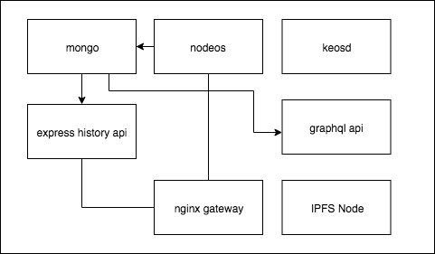
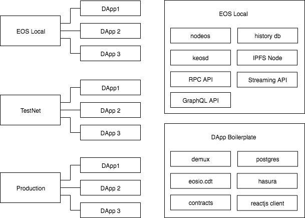

<p align="center">
	</a>
	<a href="https://git.io/col">
		
	</a>
	<a href="https://discord.gg/bBpQHym">
		
	</a>
	<a href="https://twitter.com/intent/follow?screen_name=eoscostarica">
		
	</a>
	<a href="#">
		
	</a>
</p>

<p align="center">
	
</p>

# EOS Local Network

EOS Local provides a really quick way to setup an EOS local network. 

EOS local exposes all APIs provided by EOS Costa Rica and other BPs on the TestNet and MainNet.

It allows you to develop your application running the same APIs services you will use in production in your computer.

It has a companion project that serves as a starter boilerplate your dApp.
https://github.com/eoscostarica/eos-dapp-boilerplate 


EOS Local is a community-driven project led by EOS Costa Rica. We welcome contributions of all sorts. There are many ways to help, from reporting issues, proposing features, improving documentation, contributing code, design/ux proposals, etc.

<!-- START doctoc generated TOC please keep comment here to allow auto update -->
<!-- DON'T EDIT THIS SECTION, INSTEAD RE-RUN doctoc TO UPDATE -->
**Table of Contents**  *generated with [DocToc](https://github.com/thlorenz/doctoc)*

- [Architecture](#architecture)
- [Technical Specs](#technical-specs)
- [Getting started](#getting-started)
- [Aliases](#aliases)
- [Chain Initialization](#chain-initialization)
- [Commands](#commands)
- [Directory Structure](#directory-structure)
- [Services](#services)
  - [eosio](#eosio)
  - [rpc api](#rpc-api)
  - [mongo](#mongo)
  - [graphql](#graphql)
  - [history api](#history-api)
  - [ngnix](#ngnix)
- [Using Cleos on EOS Local](#using-cleos-on-eos-local)
  - [Invoking cleos through docker exec](#invoking-cleos-through-docker-exec)
  - [Open a shell window on the containers and use cleos directly](#open-a-shell-window-on-the-containers-and-use-cleos-directly)
- [Frequently Asked Questions](#frequently-asked-questions)
  - [Why Containers ?](#why-containers-)
- [Contributing](#contributing)
- [About EOS Costa Rica](#about-eos-costa-rica)
- [License](#license)
- [Contributors](#contributors)

<!-- END doctoc generated TOC please keep comment here to allow auto update -->

## Architecture

<p align="center">
   Every service/process runs on a separate container.
</p>

<p align="center">
	
</p>


<p align="center">
   You can develop multiple dApps using the same EOS Local Network, sharing testing users and machine resources.
</p>

<p align="center">
	
</p>


## Technical Specs

- Virtualized local network with docker.
- Microservices architecture.
- Out-of-box services: 
  - EOSIO Nodeos deamon.
  - HTTP RPC API with history db.
  - Keosd wallet service.
  - GraphQL API for complex data queries.
  - Ngnix proxy.
- Services accessible through virtual host names both from host machine and within the docker network.
- Handy scripts for interacting with the local EOS services.

**Important Disclaimer: This is a Work in Progress** 

## Getting started

Basic knowledge about Docker, Docker Compose, EOS and NodeJS is required.

-  Video tutorial [Docker Containers | Learn Docker Basics in 30 Mins](https://www.youtube.com/watch?v=0kwXLcwUw0Q)

**Global Dependencies**

- Docker https://docs.docker.com/install/.   
At least 10GB RAM (Docker -> Preferences -> Advanced -> Memory -> 10GB or above)

## Aliases

It is useful to have aliases for the `docker`, `docker-compose` and `cleos` commands since they are used.

```
alias cleos='docker exec -i eoslocal_eosio cleos -u http://eosio:8888 --wallet-url http://wallet:8901'
alias eosio='docker exec -i eoslocal_eosio bash'
alias dk='docker'
alias dc='docker-compose'
```

## Chain Initialization

Execute `make setup` for:

- Docker volumes creation.
- Chain initialization.
- Testing accounts creation.

Run the following command to verify afterwards

```terminal
➜  eos-local git:(master) docker network ls
NETWORK ID          NAME                DRIVER              SCOPE
f72523603a2d        bridge              bridge              local
113510307ce3        eoslocal            bridge              local
886afbf5db1a        host                host                local
53d0d3f8d910        none                null                local

➜  eos-local git:(master) ✗ docker-compose ps
     Name                    Command               State                                        Ports
--------------------------------------------------------------------------------------------------------------
eoslocal_eosio    /bin/sh -c /wait && /opt/a ...   Up      0.0.0.0:8888->8888/tcp, 0.0.0.0:9830->9876/tcp
eoslocal_ipfs     /sbin/tini -- /usr/local/b ...   Up      0.0.0.0:4001->4001/tcp, 0.0.0.0:5001->5001/tcp,     0.0.0.0:8081->8080/tcp, 8081/tcp
eoslocal_mongo    docker-entrypoint.sh mongod      Up      0.0.0.0:27017->27017/tcp
eoslocal_nginx    /app/docker-entrypoint.sh  ...   Up      0.0.0.0:80->80/tcp
eoslocal_wallet   /opt/eosio/bin/keosd --wal ...   Up      0.0.0.0:8901->8901/tcp


➜  eos-local git:(master) cleos wallet keys
[
  "EOS5A3ZChGL2tL1oJvhN7KScmGUAT4DsxZFEywRShGQHLeN2ndp8W",
  "EOS5VdFvRRTtVQAPUJZQCYvpBekYV4nc1cFe7og9aYPTBMXZ38Koy",
  "EOS5k6Jht1epqZ2mnRLFVDXDTosaTneR6xFhvenVLiFfz5Ue125dL",
  "EOS6Jv4RykLZQQopCBdBHSwaGoMyFxyaxFNXimqFPdEXNWqgWbG1a",
  "EOS6MRyAjQq8ud7hVNYcfnVPJqcVpscN5So8BhtHuGYqET5GDW5CV",
  "EOS6TVQ6EmphCWavUuYiZMmDNYMRgbb96wgqWDncjrkvFPcpokgdD",
  "EOS6u1SNetnKtpi5xzxgcUz9Hn9MC3kUhBeiXMiQzKYuzVcr9j8ft",
  "EOS6vzfJTSUM51MEWXDyuh2fDDfs5FdRX5hn3teMdroTwaNv6ptAE",
  "EOS7C9UXs3fZCCxDW8dhLZWtcpoDRW3A9j9qaRj9euLFQDWaGADHJ",
  "EOS7CB47VMLWp49QhajE3uTuHuf9qoSeR6scUHMKGCD6LXYufRUDc",
  "EOS7Zt4QsM5bb8PR9TERKDphJ6AxefX8oLngEcc3h5kQtrMQY7b5g",
  "EOS7pvbQJxNQMEMBizL6WCCroqQkpYogUNoS3NmETy6XK73dXQsBT",
  "EOS84BLRbGbFahNJEpnnJHYCoW9QPbQEk2iHsHGGS6qcVUq9HhutG",
  "EOS8TSTK5Tuw3LGyw1KZsWeJGGidUsd5UfKKyUro27xyopu2gE5T1",
  "EOS8jj53UWtbdacA8WGpzKN88Y6F6W4AQNHHwR4Upy1F8ewVG2crD"
]

➜  eos-local git:(master) cleos get info
{
  "server_version": "59626f1e",
  "chain_id": "cf057bbfb72640471fd910bcb67639c22df9f92470936cddc1ade0e2f2e7dc4f",
  "head_block_num": 675,
  "last_irreversible_block_num": 674,
  "last_irreversible_block_id": "000002a2a6228780c7facc225ff53609ed072d57e7b6abb9a0ba92ab63b5d160",
  "head_block_id": "000002a3b39afb5f16ac7a59f747e21ef6bcc060a856237016af48ad677c7f52",
  "head_block_time": "2018-12-07T18:03:08.500",
  "head_block_producer": "eosio",
  "virtual_block_cpu_limit": 392064,
  "virtual_block_net_limit": 2057598,
  "block_cpu_limit": 199900,
  "block_net_limit": 1048576,
  "server_version_string": "v1.4.4"
}

➜  eos-local git:(master) cleos get info
{
  "server_version": "59626f1e",
  "chain_id": "cf057bbfb72640471fd910bcb67639c22df9f92470936cddc1ade0e2f2e7dc4f",
  "head_block_num": 675,
  "last_irreversible_block_num": 674,
  "last_irreversible_block_id": "000002a2a6228780c7facc225ff53609ed072d57e7b6abb9a0ba92ab63b5d160",
  "head_block_id": "000002a3b39afb5f16ac7a59f747e21ef6bcc060a856237016af48ad677c7f52",
  "head_block_time": "2018-12-07T18:03:08.500",
  "head_block_producer": "eosio",
  "virtual_block_cpu_limit": 392064,
  "virtual_block_net_limit": 2057598,
  "block_cpu_limit": 199900,
  "block_net_limit": 1048576,
  "server_version_string": "v1.4.4"
}

➜  eos-local git:(master)  curl http://eosio.eoslocal.io/v1/chain/get_info | jq
  % Total    % Received % Xferd  Average Speed   Time    Time     Time  Current
                                 Dload  Upload   Total   Spent    Left  Speed
100   566  100   566    0     0  72554      0 --:--:-- --:--:-- --:--:-- 80857
{
  "server_version": "59626f1e",
  "chain_id": "cf057bbfb72640471fd910bcb67639c22df9f92470936cddc1ade0e2f2e7dc4f",
  "head_block_num": 970,
  "last_irreversible_block_num": 969,
  "last_irreversible_block_id": "000003c9846265cddc9133024d9bd2adb1531378da8172318fe2a142b843c02a",
  "head_block_id": "000003ca6e3448f540c36f70a176f5cc4769514f8018b07fbbf32b27f532fb6b",
  "head_block_time": "2018-12-07T18:05:36.000",
  "head_block_producer": "eosio",
  "virtual_block_cpu_limit": 526492,
  "virtual_block_net_limit": 2763849,
  "block_cpu_limit": 199900,
  "block_net_limit": 1048576,
  "server_version_string": "v1.4.4"
}

➜  eos-local git:(master) curl http://localhost:8888/v1/chain/get_info | jq
  % Total    % Received % Xferd  Average Speed   Time    Time     Time  Current
                                 Dload  Upload   Total   Spent    Left  Speed
100   568  100   568    0     0  78172      0 --:--:-- --:--:-- --:--:-- 81142
{
  "server_version": "59626f1e",
  "chain_id": "cf057bbfb72640471fd910bcb67639c22df9f92470936cddc1ade0e2f2e7dc4f",
  "head_block_num": 1167,
  "last_irreversible_block_num": 1166,
  "last_irreversible_block_id": "0000048e64aedcb65234739ac489fe81f7b7d68e5c7ccb4c28bd8083b0e33213",
  "head_block_id": "0000048ff0dcc3c4e65ec0de14f9d4ae9c8823bddad2bb19f73b0245514b138c",
  "head_block_time": "2018-12-07T18:07:14.500",
  "head_block_producer": "eosio",
  "virtual_block_cpu_limit": 641088,
  "virtual_block_net_limit": 3365893,
  "block_cpu_limit": 199900,
  "block_net_limit": 1048576,
  "server_version_string": "v1.4.4"
}
```


## Commands

- `make setup` run chain initialization.
- `make flush` stops all services and removes all data.
- `make fresh` stops all services and removes all data and run chain initialization again.
- `docker-compose start` starts all containers.
- `docker-compose exec [service_name] [bash | sh]` open bash or sh in a container.
- `docker-compose stop` stops all containers.
- `docker-compose down` stops and removes all containers.
- `docker-compose restart` restarts all services.

## Directory Structure

```
.
├── docs/ .............................................. documentation files and media
├── services/ .......................................... microservices
|   ├── graphql/ ....................................... graphql service
|   |
|   ├── history-api/ ................................... express/swagger history api
|   |
|   ├── ngnix/ ......................................... nginx service for routing
|   |
|   ├── mongo/ ......................................... mongodb data
|   |
|   └── eosio/ ......................................... nodeos service
|       ├── utils/ ..................................... service utilities
|       ├── config/ .................................... eosio node configuration
|       ├── scripts/ ................................... eosio scripts
|       ├── contracts/ ................................. smart contracts 
|       └── Dockerfile ................................. service image specification 
|    
├── docker-compose.yaml ................................ docker compose for local dev
├── contributing.md .................................... contributing guidelines
├── license ............................................ project license
├── makefile ........................................... make tasks manifest
├── readme.md .......................................... project documentation
└── .editorconfig ...................................... common text editor configs
```

## Services

### eosio

The eosio node acts as block producer and history api node, this configuration is just for development. It's not recommended to for production. In production it's recommended to devide nodes responsibilities, you may want to configure a dedicate api node that stores you contracts data only or use one of the network block producers node as a service. 

The docker image source code can be found at https://github.com/EOSIO/eos/blob/master/Docker/Dockerfile.

Learn more at https://developers.eos.io/eosio-nodeos/docs/

### rpc api

https://developers.eos.io/eosio-nodeos/reference

The eos rpc api is accesible through http://localhost:8888

### mongo

MongoDB instance for to story hisotry. 
The eosio::mongo_db_plugin provides archiving of blockchain data into a MongoDB. 

https://developers.eos.io/eosio-nodeos/docs/mongo_db_plugin

### graphql 

https://github.com/EOS-BP-Developers/eosio-graphql

### history api 

https://github.com/CryptoLions/EOS-mongo-history-API


### ngnix

Nginx reverse proxy that allows accesing the services directly on the host machine the wildcard `*.esolocal.io` that points to `127.0.0.1`, therefore as long as you can hit the dns server it will redirect all requests to your machine and nginx-proxy does the internal docker network routing to the right service. 

Run `ping {whatever}.eoslocal.io` to verify.

Optionally you can avoid the round trip and work offline maintaining virtual hosts by manually adding your dns to your `hosts` file. https://en.wikipedia.org/wiki/Hosts_(file)

See the `docker-compose.yml` for available virtual hosts for easier access without port shenanigans.

## Using Cleos on EOS Local

Cleos is a command line tool that interfaces with the API exposed by nodeos. In order to use cleos you will need to have the endpoint (IP address and port number) to a nodeos instance and also configure nodeos to load the 'eosio::chain_api_plugin'. `cleos` contains documentation for all of its commands. 

More at https://developers.eos.io/eosio-nodeos/docs/cleos-overview 

EOS Local comes with 2 EOS nodes running in separate docker containers, you can interact with these nodes using `cleos` in several ways:

### Invoking cleos through docker exec

You can execute commands on any container from you host machine using the `docker exec` command.
Eg:

`docker exec -i eoslocal_eosio cleos --url http://localhost:8888/ get info`

We recomend using declaring alias on your shell configuration  Eg (.bashrc or .zshrc) 

```
alias cleos='docker exec -i eoslocal_eosio cleos -u http://eosio:8888 --wallet-url http://wallet:8901'
```

Notice it uses docker directly thru the `container_name` insted of docker compose, this allows you to invoke it from any path in your computer, you don't have to be a the root dir of eoslocal.

After you have added those lines to your config you can open a new terminal window and run `cleos --help` to test.

### Open a shell window on the containers and use cleos directly

You can also login into the containers using the following docker-compose command 

`docker exec -it eoslocal_eosio bash`

That will log you in and you will be able to execute cleos directly within the ubuntu server.
Eg.

```
➜  eos-local git:(master) ✗ docker exec -it eoslocal_eosio bash
root@b39ffe3c43c0:/opt/eosio/bin# cleos get info
{
  "server_version": "f9a3d023",
  "chain_id": "cf057bbfb72640471fd910bcb67639c22df9f92470936cddc1ade0e2f2e7dc4f",
  "head_block_num": 4900,
  "last_irreversible_block_num": 4899,
  "last_irreversible_block_id": "000013232f7193f86a4edc59b6aa2b2a8ccd6c2060d24eb0e5c497beb97b76e5",
  "head_block_id": "000013249772e5af12592d7d3eeb401276c09f781e3ed76faa75a49f53b481bd",
  "head_block_time": "2018-11-05T20:27:45.000",
  "head_block_producer": "eosio",
  "virtual_block_cpu_limit": 26829884,
  "virtual_block_net_limit": 140951435,
  "block_cpu_limit": 199900,
  "block_net_limit": 1048576,
  "server_version_string": "v1.4.1"
}
```

## Frequently Asked Questions

### Why Containers ?

The primary benefits of containers are efficiency and agility. Containers are orders of magnitude faster to provision, and much lighter-weight to build and define versus methods like omnibus software builds and full Virtual Machine images. Containers in a single OS are also more efficient at resource utilization than running a Hypervisor and guest OSs.

Efficiency and agility are good for everyone, but they become game-changers at scale. 

It also gives the ability to run distint versions of the different services like EOSIO on your laptop without conflicts.

Containers offer a logical packaging mechanism in which applications can be abstracted from the environment in which they actually run. This decoupling allows container-based applications to be deployed easily and consistently, regardless of whether the target environment is a private data center, the public cloud, or even a developer’s personal laptop. Containerization provides a clean separation of concerns, as developers focus on their application logic and dependencies, while IT operations teams can focus on deployment and management without bothering with application details such as specific software versions and configurations specific to the app.

For those coming from virtualized environments, containers are often compared with virtual machines (VMs). You might already be familiar with VMs: a guest operating system such as Linux or Windows runs on top of a host operating system with virtualized access to the underlying hardware. Like virtual machines, containers allow you to package your application together with libraries and other dependencies, providing isolated environments for running your software services. As you’ll see below however, the similarities end here as containers offer a far more lightweight unit for developers and IT Ops teams to work with, carrying a myriad of benefits.

<p align="center">
		
</p>

Learn more at https://cloud.google.com/containers/

## Contributing

We use a Kanban-style board. That's were we prioritize the work. [Go to Project Board](https://github.com/eoscostarica/eos-local/projects/3).


The main communication channels are [github issues](https://github.com/eoscostarica/eos-local/issues) and [EOS Costa Rica's Discord server](https://eoscostarica.io/discord). Feel to join and ask as many questions you may have.

Our weekly sync call is every Monday 1:00 AM UTC. [meet.eoscostarica.io](https:/meet.eoscostarica.io).

Contributing Guidelines https://developers.eoscostarica.io/docs/open-source-guidelines.

Please report bugs big and small by [opening an issue](https://github.com/eoscostarica/eos-local/issues)

## About EOS Costa Rica
<p align="center">
	<a href="https://eoscostarica.io">
		
	</a>
</p>

We challenge ourselves to provide the EOS platform with a strong geographical and political diversity by running the most robust EOS Block Producer possible from Costa Rica; We pledge to leverage our talent, experience, and sustainable internet resources to meet such an important challenge.

EOS Costa Rica supports the EOS.io community by maintaining and contributing to open source initiatives, meetups and workshops.

[eoscostarica.io](https://eoscostarica.io)

## License

MIT © [EOS Costa Rica](https://eoscostarica.io)  

## Contributors

<!-- ALL-CONTRIBUTORS-LIST:START - Do not remove or modify this section -->
<!-- prettier-ignore -->
| [<br /><sub><b>Gabo Esquivel</b></sub>](https://gaboesquivel.com)<br />[🤔](#ideas-gaboesquivel "Ideas, Planning, & Feedback") [📖](https://github.com/eoscostarica/eos-dapp-dev-env/commits?author=gaboesquivel "Documentation") [💻](https://github.com/eoscostarica/eos-dapp-dev-env/commits?author=gaboesquivel "Code") [👀](#review-gaboesquivel "Reviewed Pull Requests") | [<br /><sub><b>Daniel Prado</b></sub>](https://github.com/danazkari)<br />[💻](https://github.com/eoscostarica/eos-dapp-dev-env/commits?author=danazkari "Code") [📖](https://github.com/eoscostarica/eos-dapp-dev-env/commits?author=danazkari "Documentation") [🤔](#ideas-danazkari "Ideas, Planning, & Feedback") [👀](#review-danazkari "Reviewed Pull Requests") | [<br /><sub><b>Jorge Murillo</b></sub>](https://github.com/murillojorge)<br />[🤔](#ideas-murillojorge "Ideas, Planning, & Feedback") [📖](https://github.com/eoscostarica/eos-dapp-dev-env/commits?author=murillojorge "Documentation") [🎨](#design-murillojorge "Design") [💻](https://github.com/eoscostarica/eos-dapp-dev-env/commits?author=murillojorge "Code") [👀](#review-murillojorge "Reviewed Pull Requests") | [<br /><sub><b>Xavier Fernandez</b></sub>](https://github.com/xavier506)<br />[🤔](#ideas-xavier506 "Ideas, Planning, & Feedback") [📝](#blog-xavier506 "Blogposts") [📢](#talk-xavier506 "Talks") [🚇](#infra-xavier506 "Infrastructure (Hosting, Build-Tools, etc)") | [<br /><sub><b>Rubén Abarca Navarro</b></sub>](https://github.com/rubenabix)<br />[🤔](#ideas-rubenabix "Ideas, Planning, & Feedback") [👀](#review-rubenabix "Reviewed Pull Requests") [💻](https://github.com/eoscostarica/eos-dapp-dev-env/commits?author=rubenabix "Code") | [<br /><sub><b>jsegura17</b></sub>](https://github.com/jsegura17)<br />[💻](https://github.com/eoscostarica/eos-dapp-dev-env/commits?author=jsegura17 "Code") [👀](#review-jsegura17 "Reviewed Pull Requests") [🤔](#ideas-jsegura17 "Ideas, Planning, & Feedback") | [<br /><sub><b>Leo Ribeiro</b></sub>](http://leordev.github.io)<br />[🤔](#ideas-leordev "Ideas, Planning, & Feedback") [👀](#review-leordev "Reviewed Pull Requests") |
| :---: | :---: | :---: | :---: | :---: | :---: | :---: |
| [<br /><sub><b>Mariano Alvarez</b></sub>](https://github.com/mahcr)<br />[🤔](#ideas-mahcr "Ideas, Planning, & Feedback") [👀](#review-mahcr "Reviewed Pull Requests") | [<br /><sub><b>Julien Lucca</b></sub>](http://lucca65.github.io)<br />[💻](https://github.com/eoscostarica/eos-dapp-dev-env/commits?author=lucca65 "Code") [👀](#review-lucca65 "Reviewed Pull Requests") [🤔](#ideas-lucca65 "Ideas, Planning, & Feedback") | [<br /><sub><b>Edgar Fernandez</b></sub>](http://www.eoscostarica.io)<br />[🤔](#ideas-edgar-eoscostarica "Ideas, Planning, & Feedback") [📝](#blog-edgar-eoscostarica "Blogposts") [📢](#talk-edgar-eoscostarica "Talks") | [<br /><sub><b>César Rodríguez</b></sub>](http://www.kesarito.com)<br />[🤔](#ideas-kesar "Ideas, Planning, & Feedback") | [<br /><sub><b>Pacien Boisson</b></sub>](https://ngfar.io)<br />[🤔](#ideas-pakokrew "Ideas, Planning, & Feedback") | [<br /><sub><b>Alex Gomory</b></sub>](https://github.com/GMory)<br />[💻](https://github.com/eoscostarica/eos-dapp-dev-env/commits?author=GMory "Code") [🤔](#ideas-GMory "Ideas, Planning, & Feedback") [📢](#talk-GMory "Talks") |
<!-- ALL-CONTRIBUTORS-LIST:END -->
Thanks goes to these wonderful people ([emoji key](https://github.com/kentcdodds/all-contributors#emoji-key)):

<!-- ALL-CONTRIBUTORS-LIST:START - Do not remove or modify this section -->
<!-- prettier-ignore -->
<!-- ALL-CONTRIBUTORS-LIST:END -->

This project follows the [all-contributors](https://github.com/kentcdodds/all-contributors) specification. Contributions of any kind welcome!
