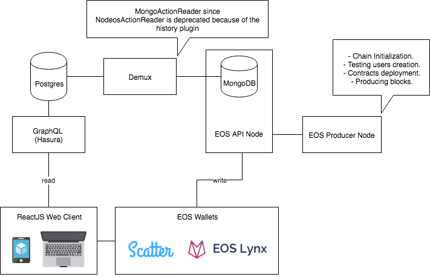
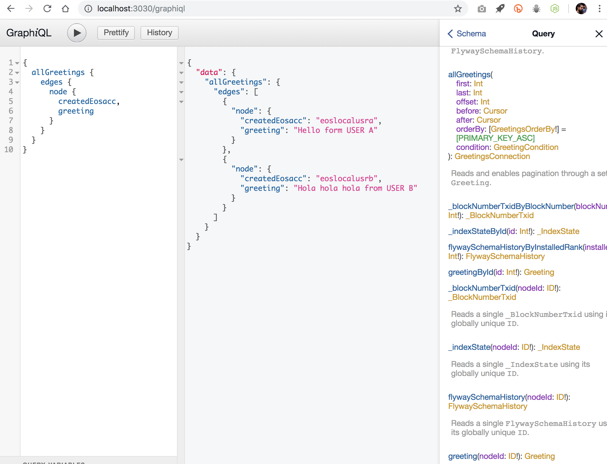
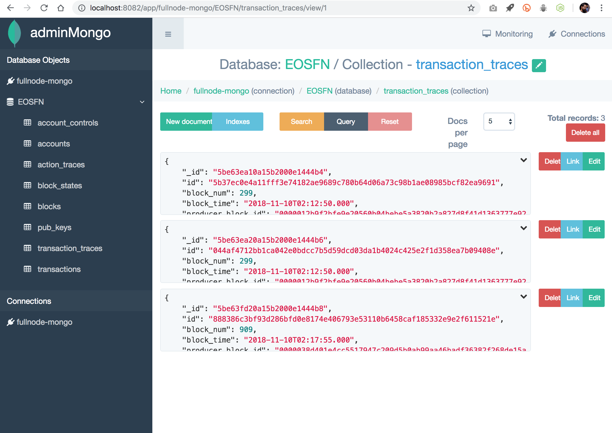
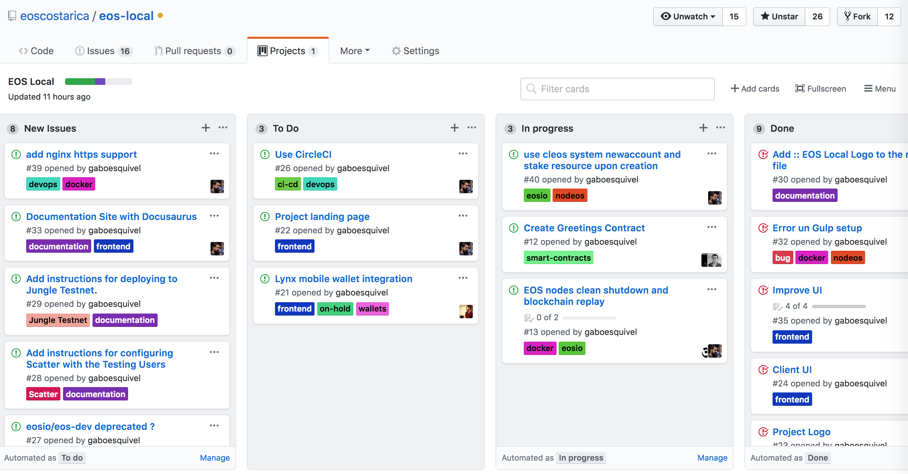

<p align="center">
	</a>
	<a href="https://git.io/col">
		
	</a>
	<a href="https://discord.gg/bBpQHym">
		
	</a>
	<a href="https://twitter.com/intent/follow?screen_name=eoscostarica">
		
	</a>
	<a href="#">
		
	</a>
</p>

<p align="center">
	
</p>

# EOS Local dApp development environment

EOS Local provides a really quick way to setup and maintain a local development environment for EOS dApps. It is a docker based dev environment that is guaranteed to work out-of-the-box across the different host operating systems: Mac OS, Windows, and Linux.

This project was inspired on MonsterEOS' **EOSIO Dream Stack** architecture that will allow you to develop EOS applications faster and easily scale as necessary.

EOS Local is a community-driven project led by EOS Costa Rica. We welcome contributions of all sorts. There are many ways to help, from reporting issues, proposing features, improving documentation, contributing code, design/ux proposals, etc.

<!-- START doctoc generated TOC please keep comment here to allow auto update -->
<!-- DON'T EDIT THIS SECTION, INSTEAD RE-RUN doctoc TO UPDATE -->
**Table of Contents**  *generated with [DocToc](https://github.com/thlorenz/doctoc)*

- [Architecture](#architecture)
- [Advantages](#advantages)
- [Technical Specs](#technical-specs)
- [Getting started](#getting-started)
  - [Installation](#installation)
- [Make Commands](#make-commands)
- [Chain Initialization and Database Migrations](#chain-initialization-and-database-migrations)
- [Directory Structure](#directory-structure)
- [Designing and Developing EOS Smart Contracts](#designing-and-developing-eos-smart-contracts)
- [Services](#services)
  - [demux](#demux)
  - [graphql](#graphql)
    - [hasura](#hasura)
  - [eos-producer](#eos-producer)
  - [eos-api-node](#eos-api-node)
  - [postgres](#postgres)
  - [flyway](#flyway)
  - [pgweb](#pgweb)
  - [mongodb](#mongodb)
  - [admin-mongo](#admin-mongo)
  - [ngnix-proxy](#ngnix-proxy)
  - [reactjs web client](#reactjs-web-client)
    - [components](#components)
- [Continuous Integration Process](#continuous-integration-process)
- [Using Cleos on EOS Local](#using-cleos-on-eos-local)
  - [Invoking cleos through docker-compose exec](#invoking-cleos-through-docker-compose-exec)
  - [SHH into the containers and use cleos directly](#shh-into-the-containers-and-use-cleos-directly)
- [EOS Documentation & Resources](#eos-documentation--resources)
- [Frequently Asked Questions](#frequently-asked-questions)
  - [How does this project compare to EOSFactory ?](#how-does-this-project-compare-to-eosfactory-)
  - [Why Containers ?](#why-containers-)
  - [Why Database Migrations ?](#why-database-migrations-)
  - [Who is using EOS Local ?](#who-is-using-eos-local-)
- [Contributing](#contributing)
- [Awesome Lists](#awesome-lists)
- [Support](#support)
- [About EOS Costa Rica](#about-eos-costa-rica)
- [License](#license)
- [Contributors](#contributors)

<!-- END doctoc generated TOC please keep comment here to allow auto update -->

## Architecture

<p align="center">
	
</p>

## Advantages

- Get started with EOS DApp development in less than 5 minutes with a single command.
- Focus on your features, not on configurations or integrating commonly used third party-services.
- Scalable microservices architecture. 
- Deploy your dApp dedicated services easily to any infrastructure provider with containers.  
- Ability to run multiple versions of EOS with different configuration with no conflicts.
- This project follows EOS DApp development best practices.

## Technical Specs

- Fully virtualized EOS blockchain development environment.
- Microservices architecture.
- Out-of-box services: 
  - EOS producer node with eosio.cdt for automated contracts compilation.
  - EOS api node with mongo plugin.
  - EOS block explorer. WIP [eos-local/issues/45](https://github.com/eoscostarica/eos-local/issues/45)
  - Admin Mongo for exploring the api node stored transactions.  
  - Demux service for executing side effects and data replication to postgres. 
  - GraphQL endpoint for executing complex data queries with ease.
  - Postgres database.
  - PGWeb instance for exploring the postgres database.
  - Flyway service for Postgres DB migrations.
  - Reactjs client with:
    - Scatter integration. 
    - Lynx integration. WIP [eos-local/issues/21](https://github.com/eoscostarica/eos-local/issues/21)
    - Material UI.
    - GraphQL Apollo client.
- Services accessible through virtual host names both from host machine and within the docker network.
- Handy scripts for interacting with the local EOS services.
- Make as global task manager.
- Automated code linting and testing.
- Automated "seeding" of testing accounts and contract compilation.
- Continuous Integration and Deployment. ( Travis and Netlify ) - CircleCI soon [eos-local/issues/26)](https://github.com/eoscostarica/eos-local/issues/26)

*Note: at the moment we are not using a docker container for running the React client due to issues related to hot reloading the app efficiently*

**Important Disclaimer: This is a Work in Progress** 

## Getting started

Basic knowledge about Docker, Docker Compose, EOS and NodeJS is required.

### Installation

**Global Dependencies**

- Docker https://docs.docker.com/install/.   
At least 10GB RAM (Docker -> Preferences -> Advanced -> Memory -> 10GB or above)

**Optionally**
- Install node.js v11 on your machine. We recommend using [n](https://github.com/tj/n) or [nvm](https://github.com/creationix/nvm), and [avn](https://github.com/wbyoung/avn) to manage multiple node.js versions on your computer.
- Yarn https://yarnpkg.com/lang/en/docs/install/.

## Make Commands

- `make setup` run chain initialization and database migrations.
- `make start` starts the docker containers.
- `make stop` stops and removes all containers.
- `make restart` restarts all services.
- `make flush` stops all services and remove all blockchain and database data.
- `make logs` displays and follows all services logs.
- `make migrate` executes flywaydb migrations against the postgres database.
- `make psql` connects you to the postgres db instance thru command line.

## Chain Initialization and Database Migrations

When you run `make setup` several things will happen:

- Chain initialization.
- Testing Users Creation.
- Contracts Compilation and deployment.
- Postgres Schema Creation.
- Postgres Database Migrations.

See [services/eos-dev/scripts/0000_init_chain.sh](https://github.com/eoscostarica/eos-local/blob/master/services/eos-dev/scripts/0000_init-chain.sh)

## Directory Structure

```
.
├── docs/ .............................................. documentation files and media
├── contracts/ ......................................... eos smart contracts 
├── services/ .......................................... microservices
|   ├── demux/ ......................................... demux-js service
|   |   ├── utils/ ..................................... general utilities
|   |   ├── src/ ....................................... application biz logic 
|   |   ├── Dockerfile ................................. service image spec 
|   |   ├── pm2.config.js .............................. process specs for pm2
|   |   ├── tsconfig.json .............................. tslint config
|   |   ├── tslint.json ................................ code style rules
|   |   └── package.json ............................... service dependencies manifest
|   |
|   ├── eos-producer/ .................................. eos producer node
|   |   ├── utils/ ..................................... general utilities
|   |   ├── config/ .................................... eos node config
|   |   ├── scripts/ ................................... chain and wallet init scripts
|   |   ├── Dockerfile ................................. service image spec 
|   |   └── start.sh ................................... service startup script
|   |
|   ├── eos-api-node/ .................................. eos eos-api-node
|   |   ├── utils/ ..................................... general utilities
|   |   ├── config.ini ................................. eos node configuration file
|   |   ├── Dockerfile ................................. service image spec 
|   |   └── start.sh ................................... service startup script
|   |
|   ├── postgres/ ...................................... postgres db service
|   |   └── migrations/ ................................ flyway migrations
|   |
|   ├── hasura/ ........................................ graphql endpoint service
|   |   └── migrations/ ................................ hasura migrations
|   |
|   └── frontend/ ...................................... reactjs frontend
|       ├── public/ .................................... static and public files
|       ├── src/ ....................................... reactjs views and components
|       ├── config-overrides.js ........................ configuration overrides for `cra`
|       ├── .env ....................................... environment variables
|       ├── .eslintrc .................................. code style rules
|       └── package.json ............................... service dependencies manifest
|   
├── docker-compose.yaml ................................ docker compose for local dev
├── contributing.md .................................... contributing guidelines
├── license ............................................ project license
├── makefile ........................................... make tasks manifest
├── readme.md .......................................... project documentation
├── netlify.toml ....................................... netlify config file
├── .travis.yml ........................................ travis ci config file
└── .editorconfig ...................................... common text editor configs
```

## Designing and Developing EOS Smart Contracts

Recommended process for designing EOS Smart Contracts.  

<p align="center">
	
</p>

Simple use case of equipment rentals that list their equipment for rent and renters who pay rent for those items.
[digital-scarcity/equiprental](https://github.com/digital-scarcity/equiprental)


## Services

### demux

Demux is a backend infrastructure pattern for sourcing blockchain events to deterministically update queryable datastores and trigger side effects. 

Taking inspiration from the [Flux Architecture](https://facebook.github.io/flux/docs/in-depth-overview.html#content) pattern and [Redux](https://github.com/reduxjs/redux/), Demux was born out of the following qualifications:

1. A separation of concerns between how state exists on the blockchain and how it is queried by the client front-end
1. Client front-end not solely responsible for determining derived, reduced, and/or accumulated state
1. The ability for blockchain events to trigger new transactions, as well as other side effects outside of the blockchain
1. The blockchain as the single source of truth for all application state

<p align="center">
		
</p>

1. Client sends transaction to blockchain.
1. Action Watcher invokes Action Reader to check for new blocks.
1. Action Reader sees transaction in new block, parses actions.
1. Action Watcher sends actions to Action Handler.
1. Action Handler processes actions through Updaters and Effects.
1. Actions run their corresponding Updaters, updating the state of the Datastore.
1. Actions run their corresponding Effects, triggering external events.
1. Client queries API for updated data.

Learn more at https://github.com/EOSIO/demux-js.

### graphql 

GraphQL is a query language for APIs and a runtime for fulfilling those queries with your existing data. GraphQL provides a complete and understandable description of the data in your API, gives clients the power to ask for exactly what they need and nothing more, makes it easier to evolve APIs over time, and enables powerful developer tools.

There are many reason for choosing GraphQL over other solutions, read [Top 5 Reasons to Use GraphQL](https://www.prisma.io/blog/top-5-reasons-to-use-graphql-b60cfa683511/).

__Move faster with powerful developer tools__

Know exactly what data you can request from your API without leaving your editor, highlight potential issues before sending a query, and take advantage of improved code intelligence. GraphQL makes it easy to build powerful tools like [GraphiQL](https://github.com/graphql/graphiql) by leveraging your API’s type system.

The GraphiQL instance on EOS Local is available at http://localhost:8088/console/api-explorer

<p align="center">
	
</p>

Learn more at https://graphql.org & https://www.howtographql.com

#### hasura 

Hasura GraphQL engine automatically generates your GraphQL schema and resolvers based on your tables/views in Postgres. You don’t need to write a GraphQL schema or resolvers.

The Hasura console gives you UI tools that speed up your data-modeling process, or working with your existing database. The console also automatically generates migrations or metadata files that you can edit directly and check into your version control.

Hasura GraphQL engine lets you do anything you would usually do with Postgres by giving you GraphQL over native Postgres constructs.

Learn more at https://hasura.io

### eos-producer

The producer node acts as "genesis" node and we use this server for contract compilation with eosio.cdt.

EOSIO.CDT is a toolchain for WebAssembly (WASM) and set of tools to facilitate contract writing for the EOSIO platform. In addition to being a general purpose WebAssembly toolchain, EOSIO specific optimizations are available to support building EOSIO smart contracts. This new toolchain is built around Clang 7, which means that EOSIO.CDT has the most currently available optimizations and analyses from LLVM, but as the WASM target is still considered experimental some optimizations are not available or incomplete.

EOS Local uses the docker service for automated contracts compilation.

Learn more at https://github.com/EOSIO/eosio.cdt

### eos-api-node

This is node has the mongodb plugin and provides the RPC API endpoint.

The config file is located at https://github.com/eoscostarica/eos-local/blob/master/services/eos-api-node/config.ini

The docker image source code can be found at https://github.com/EOSIO/eos/blob/master/Docker/Dockerfile.

### postgres

PostgreSQL is a powerful, open source object-relational database system with over 30 years of active development that has earned it a strong reputation for reliability, feature robustness, and performance.

- Postgres has a strongly typed schema that leaves very little room for errors. You first create the schema for a table and then add rows to the table. You can also define relationships between different tables with rules so that you can store related data across several tables and avoid data duplication.

- You can change tables in PostgreSQL without requiring to lock it for every operation. For example, you can add a column and set a default value quickly without locking the entire table. This ensures that every row in a table has the column and your codebase remains clean without needing to check if the column exists at every stage. It is also much quicker to update every row since Postgres doesn't need to retrieve each row, update, and put it back.

- Postgres also supports JSONB, which lets you create unstructured data, but with data constraint and validation functions to help ensure that JSON documents are more meaningful. The folks at Sisense have written a great blog with a detailed comparison of [Postgres vs MongoDB for JSON documents](https://www.sisense.com/blog/postgres-vs-mongodb-for-storing-json-data/).

- The newest round of performance comparisons of PostgreSQL and MongoDB produced a near repeat of the results from the first tests that proved PostgreSQL can outperform MongoDB.

<p align="center">
		
</p>

Learn more at https://www.postgresql.org

### flyway

Flyway is an open-source database migration tool. It strongly favors simplicity and convention over configuration.
It is based around just 7 basic commands: Migrate, Clean, Info, Validate, Undo, Baseline and Repair.
EOS Local leverages Flyway to manage the Postgres database migrations.

Learn more at https://flywaydb.org/documentation/migrations & https://flywaydb.org/documentation/videos

### pgweb

Pgweb is a web-based database browser for PostgreSQL, written in Go and works on OSX, Linux and Windows machines. Main idea behind using Go for backend development is to utilize ability of the compiler to produce zero-dependency binaries for multiple platforms. Pgweb was created as an attempt to build very simple and portable application to work with local or remote PostgreSQL databases.

<p align="center">
	
</p>

Docker compose exposes a pgweb instance on http://localhost:8081 and also through http://pgweb.eoslocal.io with the nginx reverse-proxy.

### mongodb

MongoDB instance for the eos-api-node. 

The eosio::mongo_db_plugin provides archiving of blockchain data into a MongoDB. It is recommended that the plugin be added to a non-producing node as it is designed to shut down on any failed insert into the MongoDB and is resource intensive.

https://developers.eos.io/eosio-nodeos/docs/mongo_db_plugin

### admin-mongo

AdminMongo is a Web based user interface (GUI) to handle all your MongoDB connections/databases needs. adminMongo is fully responsive and should work on a range of devices.

Out-of-the-box it is connected to the eos-api-node mongodb instance and allows you to explore transactions and other data in that database. Docker compose exposes it on http://localhost:8082 and thru http://admin-mongo.eoslocal.io with the nginx reverse-proxy.

<p align="center">
	
</p>

_adminMongo connection information (including username/password) is stored unencrypted in a config file, it is not recommended to run this application on a production or public facing server without proper security considerations._

Learn more https://mrvautin.com/adminmongo/

### ngnix-proxy

Nginx reverse proxy that allows accesing the services directly on the host machine the wildcard `*.esolocal.io` that points to `127.0.0.1`, therefore as long as you can hit the dns server it will redirect all requests to your machine and nginx-proxy does the internal docker network routing to the right service. 

Run `ping {whatever}.eoslocal.io` to verify.

Optionally you can avoid the round trip and work offline maintaining virtual hosts by manually adding your dns to your `hosts` file. https://en.wikipedia.org/wiki/Hosts_(file)

See the `docker-compose.yml` for available virtual hosts for easier access without port shenanigans.

### reactjs web client

In the services/frontend folder you will find a production ready frontend with Scatter and Lynx libraries ready for you to use. 

<p align="center">
	
</p>

#### components

- [react-app-rewired](https://github.com/timarney/react-app-rewired) for tweaking `create-react-app` configuration without ejecting.
- [reach-router](https://github.com/reach/router) for a more accessible router.
- state management with [rematch](https://github.com/rematch/rematch) to use `redux` best practices without all the boilerplate.
- [react-apollo](https://github.com/apollographql/react-apollo) react apollo client.
- [material-ui](https://github.com/mui-org/material-ui).
- [scatter-js](https://github.com/GetScatter/scatter-js).
- [eoslynx integration](https://developers.eoslynx.com/).

## Continuous Integration Process

- [TravisCI](https://travis-ci.org/) to run test and code style checks.  We are planning on moving to Circle CI https://github.com/eoscostarica/eos-local/projects/3.
- [Netlify](https://netlify.com) for continuous delivery and creation of ephemeral test environments.

## Using Cleos on EOS Local

Cleos is a command line tool that interfaces with the REST API exposed by nodeos. In order to use cleos you will need to have the end point (IP address and port number) to a nodeos instance and also configure nodeos to load the 'eosio::chain_api_plugin'. `cleos` contains documentation for all of its commands. 

More at https://developers.eos.io/eosio-nodeos/docs/cleos-overview 

EOS Local comes with 2 EOS nodes running in separate docker containers, you can interact with these nodes using `cleos` in several ways:

### Invoking cleos through docker-compose exec

You can execute commands on any container from you host machine using the `docker-compose exec` command.
Eg:

`docker-compose exec eos-producer cleos --url http://localhost:8888/`

We recomend using declaring alias on your shell configuration  Eg (.bashrc or .zshrc) 

```
alias cleos_producer='docker-compose exec eos-producer cleos --url http://localhost:8888/'
alias cleos_api_node='docker-compose exec eos-api-node cleos --url http://localhost:8888/'
```

After you have added those lines to your config you can open a new terminal window and run `cleos_eos-producer --help` and `cleos_api_node --help` to test.

### SHH into the containers and use cleos directly

You can also login into the containers using the following docker-compose command 

`docker-compose exec [service_name] bash`  where `service_name` is either `eos-producer` or `eos-api-node`

That will log you in and you will be able to execute cleos directly within the ubuntu server.
Eg.

```
➜  eos-local git:(master) ✗ docker-compose exec eos-producer bash
root@b39ffe3c43c0:/opt/eosio/bin# cleos get info
{
  "server_version": "f9a3d023",
  "chain_id": "cf057bbfb72640471fd910bcb67639c22df9f92470936cddc1ade0e2f2e7dc4f",
  "head_block_num": 4900,
  "last_irreversible_block_num": 4899,
  "last_irreversible_block_id": "000013232f7193f86a4edc59b6aa2b2a8ccd6c2060d24eb0e5c497beb97b76e5",
  "head_block_id": "000013249772e5af12592d7d3eeb401276c09f781e3ed76faa75a49f53b481bd",
  "head_block_time": "2018-11-05T20:27:45.000",
  "head_block_producer": "eosio",
  "virtual_block_cpu_limit": 26829884,
  "virtual_block_net_limit": 140951435,
  "block_cpu_limit": 199900,
  "block_net_limit": 1048576,
  "server_version_string": "v1.4.1"
}
```

## EOS Documentation & Resources

- https://github.com/EOSIO/eos/tree/master/Docker
- https://developers.eos.io  
- https://github.com/EOSIO/eosio.contracts  
- https://learn.eoscostarica.io    
- https://github.com/slowmist/eos-smart-contract-security-best-practices    
- https://nadejde.github.io/eos-token-sale    
- https://docs.docker.com/kitematic/userguide/    

## Frequently Asked Questions

### How does this project compare to EOSFactory ?

EOSFactory is Python-based framework for building and testing EOS smart contracts. EOS Local has a larger scope. It is Docker-based and serves as boilerplate to start a scalable EOSIO project with microservices architecture following best practices at all levels. It includes many required services for large-scale EOSIO based applications and ReactJS client with Scatter and Lynx already integrated.

### Why Containers ?

The primary benefits of containers are efficiency and agility. Containers are orders of magnitude faster to provision, and much lighter-weight to build and define versus methods like omnibus software builds and full Virtual Machine images. Containers in a single OS are also more efficient at resource utilization than running a Hypervisor and guest OSs.

Efficiency and agility are good for everyone, but they become game-changers at scale. 

It also gives the ability to run distint versions of the different services like EOSIO on your laptop without conflicts.

Containers offer a logical packaging mechanism in which applications can be abstracted from the environment in which they actually run. This decoupling allows container-based applications to be deployed easily and consistently, regardless of whether the target environment is a private data center, the public cloud, or even a developer’s personal laptop. Containerization provides a clean separation of concerns, as developers focus on their application logic and dependencies, while IT operations teams can focus on deployment and management without bothering with application details such as specific software versions and configurations specific to the app.

For those coming from virtualized environments, containers are often compared with virtual machines (VMs). You might already be familiar with VMs: a guest operating system such as Linux or Windows runs on top of a host operating system with virtualized access to the underlying hardware. Like virtual machines, containers allow you to package your application together with libraries and other dependencies, providing isolated environments for running your software services. As you’ll see below however, the similarities end here as containers offer a far more lightweight unit for developers and IT Ops teams to work with, carrying a myriad of benefits.

<p align="center">
		
</p>

Learn more at https://cloud.google.com/containers/

### Why Database Migrations ?

- It enables a rock-solid deployment process because you are doing exactly the same when updating your local database, your development database, your QA database, your acceptance database and your production database. It’s always the same process and it can be automated.
- You can easily bring a (CI-)database to the point you want by loading a baseline backup and running all migration scripts until a certain point.
- If you do it right you have database versioning and change documentation included
- The approach encourages small changes at a time, leading to less risky deployments
- It enables and empowers continuous integration because you can easily transport your functional stat to different data sets (e.g. test data)
- You know exactly what’s happening. That’s in my opinion the greatest benefit of all, because it gives you confidence that what you’re delivering will work. It also gives you enormous flexibility and lets you solve any kind of challenge – even and especially ones which need specific business logic.

Learn more at https://dev.to/pesse/one-does-not-simply-update-a-database--migration-based-database-development-527d

### Who is using EOS Local ?

- [BeSpiral](http://bespiral.com).
- [EOS Rate](https://rate.eoscostarica.io).
- [DMeetup](https://github.com/eoscostarica/dmeetup).
- Add your project by creating a pull request.

## Contributing

We use a Kanban-style board. That's were we prioritize the work. [Go to Project Board](https://github.com/eoscostarica/eos-local/projects/3).

<p align="center">
	
</p>

The main communication channels are [github issues](https://github.com/eoscostarica/eos-local/issues) and [EOS Costa Rica's Discord server](https://eoscostarica.io/discord). Feel to join and ask as many questions you may have.

Our weekly sync call is every Monday 1:00 AM UTC. [meet.eoscostarica.io](https:/meet.eoscostarica.io).

Contributing Guidelines https://developers.eoscostarica.io/docs/open-source-guidelines.

Please report bugs big and small by [opening an issue](https://github.com/eoscostarica/eos-local/issues)

## Awesome Lists

- https://github.com/EOS-Nation/Awesome-EOS
- https://github.com/DanailMinchev/awesome-eosio
- https://github.com/kesar/eos-awesome-contracts/
- https://github.com/veggiemonk/awesome-docker
- https://github.com/dhamaniasad/awesome-postgres
- https://github.com/ramnes/awesome-mongodb
- https://github.com/enaqx/awesome-react
- https://github.com/jaredpalmer/awesome-react-render-props
- https://github.com/chentsulin/awesome-graphql

## Support

Contact the team directly on the #eos-local channel on [EOS Costa Rica's Discord server](https://eoscostarica.io/discord), we will assist you as soon as possible.

## About EOS Costa Rica
<p align="center">
	<a href="https://eoscostarica.io">
		
	</a>
</p>

We challenge ourselves to provide the EOS platform with a strong geographical and political diversity by running the most robust EOS Block Producer possible from Costa Rica; We pledge to leverage our talent, experience, and sustainable internet resources to meet such an important challenge.

EOS Costa Rica supports the EOS.io community by maintaining and contributing to open source initiatives, meetups and workshops.

[eoscostarica.io](https://eoscostarica.io)

## License

MIT © [EOS Costa Rica](https://eoscostarica.io)  

## Contributors

<!-- ALL-CONTRIBUTORS-LIST:START - Do not remove or modify this section -->
<!-- prettier-ignore -->
| [<br /><sub><b>Gabo Esquivel</b></sub>](https://gaboesquivel.com)<br />[🤔](#ideas-gaboesquivel "Ideas, Planning, & Feedback") [📖](https://github.com/eoscostarica/eos-dapp-dev-env/commits?author=gaboesquivel "Documentation") [💻](https://github.com/eoscostarica/eos-dapp-dev-env/commits?author=gaboesquivel "Code") [👀](#review-gaboesquivel "Reviewed Pull Requests") | [<br /><sub><b>Daniel Prado</b></sub>](https://github.com/danazkari)<br />[💻](https://github.com/eoscostarica/eos-dapp-dev-env/commits?author=danazkari "Code") [📖](https://github.com/eoscostarica/eos-dapp-dev-env/commits?author=danazkari "Documentation") [🤔](#ideas-danazkari "Ideas, Planning, & Feedback") [👀](#review-danazkari "Reviewed Pull Requests") | [<br /><sub><b>Jorge Murillo</b></sub>](https://github.com/murillojorge)<br />[🤔](#ideas-murillojorge "Ideas, Planning, & Feedback") [📖](https://github.com/eoscostarica/eos-dapp-dev-env/commits?author=murillojorge "Documentation") [🎨](#design-murillojorge "Design") [💻](https://github.com/eoscostarica/eos-dapp-dev-env/commits?author=murillojorge "Code") [👀](#review-murillojorge "Reviewed Pull Requests") | [<br /><sub><b>Xavier Fernandez</b></sub>](https://github.com/xavier506)<br />[🤔](#ideas-xavier506 "Ideas, Planning, & Feedback") [📝](#blog-xavier506 "Blogposts") [📢](#talk-xavier506 "Talks") [🚇](#infra-xavier506 "Infrastructure (Hosting, Build-Tools, etc)") | [<br /><sub><b>Rubén Abarca Navarro</b></sub>](https://github.com/rubenabix)<br />[🤔](#ideas-rubenabix "Ideas, Planning, & Feedback") [👀](#review-rubenabix "Reviewed Pull Requests") [💻](https://github.com/eoscostarica/eos-dapp-dev-env/commits?author=rubenabix "Code") | [<br /><sub><b>jsegura17</b></sub>](https://github.com/jsegura17)<br />[💻](https://github.com/eoscostarica/eos-dapp-dev-env/commits?author=jsegura17 "Code") [👀](#review-jsegura17 "Reviewed Pull Requests") [🤔](#ideas-jsegura17 "Ideas, Planning, & Feedback") | [<br /><sub><b>Leo Ribeiro</b></sub>](http://leordev.github.io)<br />[🤔](#ideas-leordev "Ideas, Planning, & Feedback") [👀](#review-leordev "Reviewed Pull Requests") |
| :---: | :---: | :---: | :---: | :---: | :---: | :---: |
| [<br /><sub><b>Mariano Alvarez</b></sub>](https://github.com/mahcr)<br />[🤔](#ideas-mahcr "Ideas, Planning, & Feedback") [👀](#review-mahcr "Reviewed Pull Requests") | [<br /><sub><b>Julien Lucca</b></sub>](http://lucca65.github.io)<br />[👀](#review-lucca65 "Reviewed Pull Requests") [🤔](#ideas-lucca65 "Ideas, Planning, & Feedback") | [<br /><sub><b>Edgar Fernandez</b></sub>](http://www.eoscostarica.io)<br />[🤔](#ideas-edgar-eoscostarica "Ideas, Planning, & Feedback") [📝](#blog-edgar-eoscostarica "Blogposts") [📢](#talk-edgar-eoscostarica "Talks") | [<br /><sub><b>César Rodríguez</b></sub>](http://www.kesarito.com)<br />[🤔](#ideas-kesar "Ideas, Planning, & Feedback") | [<br /><sub><b>Pacien Boisson</b></sub>](https://ngfar.io)<br />[🤔](#ideas-pakokrew "Ideas, Planning, & Feedback") |
<!-- ALL-CONTRIBUTORS-LIST:END -->
Thanks goes to these wonderful people ([emoji key](https://github.com/kentcdodds/all-contributors#emoji-key)):

<!-- ALL-CONTRIBUTORS-LIST:START - Do not remove or modify this section -->
<!-- prettier-ignore -->
<!-- ALL-CONTRIBUTORS-LIST:END -->

This project follows the [all-contributors](https://github.com/kentcdodds/all-contributors) specification. Contributions of any kind welcome!
